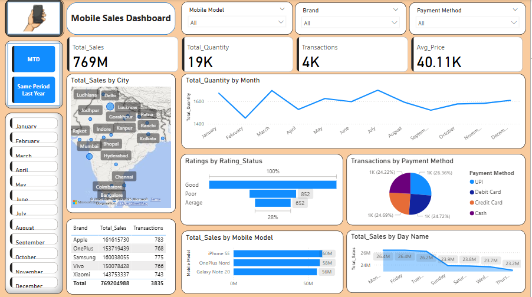
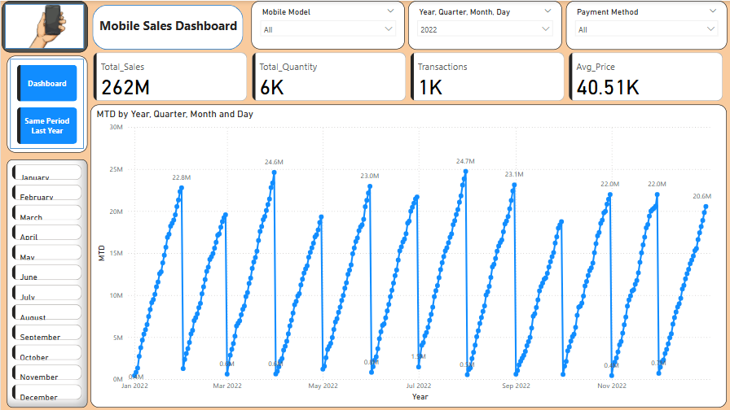
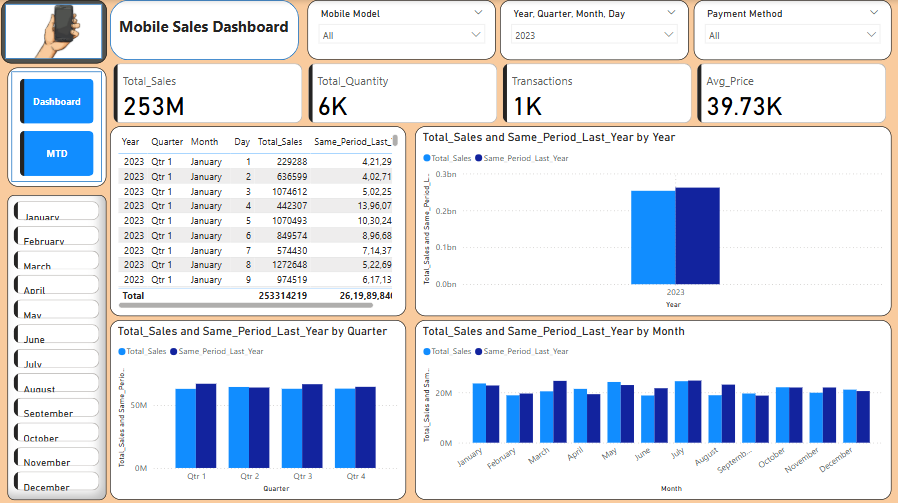

# 📊 Mobile Sales Dashboard - Power BI

This Power BI dashboard visualizes mobile sales data across regions, models, and payment methods.

## 📌 Key Features
- Total sales & quantity trends
- Ratings analysis
- Payment method breakdown
- Sales by city and brand
- Time comparisons (MTD, YoY)

## 📷 Screenshots
### Page 1

### Page 2

### Page 3

## 📁 Files
- `Mobile_Sales_Dashboard.pbix` - Main Power BI file
- `Mobile Sales Data.xlsx` - Dataset
- PNGs - Dashboard visuals
